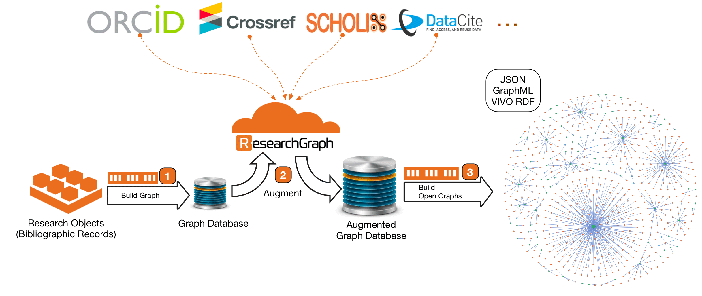

# Welcome to the Augment API Documentation

## Join our Beta Testing!

!!! tip

    We are pleased to announce that we are opening the registration for a Closed Beta Testing of
    the Augment API. You can register your interest in the API using the following EOI form:
    [https://forms.gle/jv5xPh5zN8PQfsu78](https://forms.gle/jv5xPh5zN8PQfsu78)

## What is Augment API?

The Research Graph Augment API transforms disconnected research information to a connected graph, and augment this graph with the data from the global network of scholarly works. Augment API leverages the Research Graph distributed network and persistent identifiers to establish connections between publications, researchers, research datasets and grants across global infrastructures such as DataCite and open access initiatives such as Scholix.

The Augment API provides cloud hosted functions to enable three transformations.

- Build Graph: Transform disconnected bibliographic records to a connected graph
- Augment: Transform the graph with data from Research Graph clusters and the global research data infrastructures.
- Create Open Graphs: Transform the augmented graph to interoperable formats such as VIVO RDF, GraphML and JSON.
